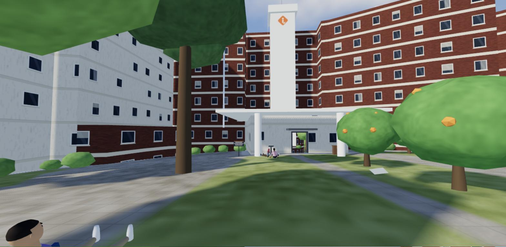
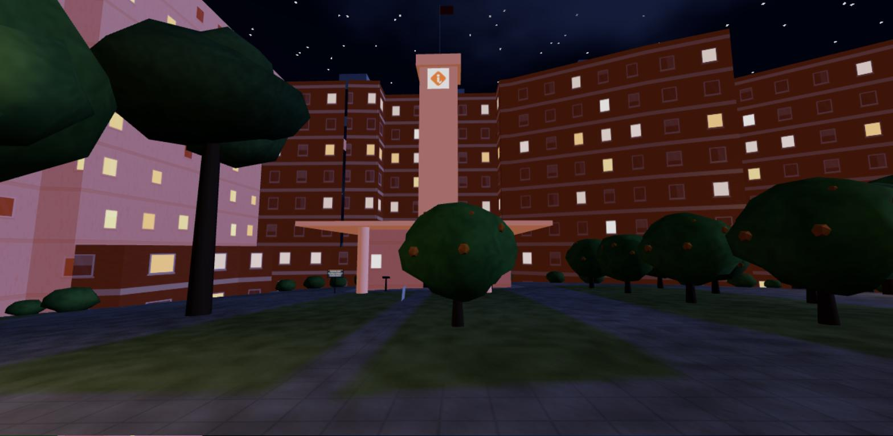
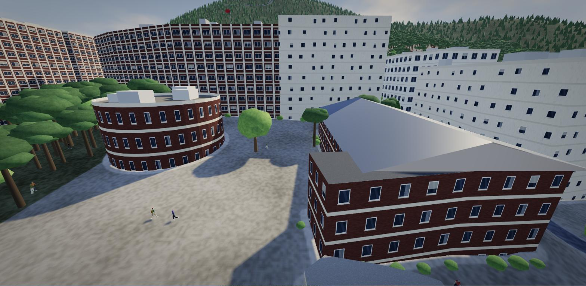
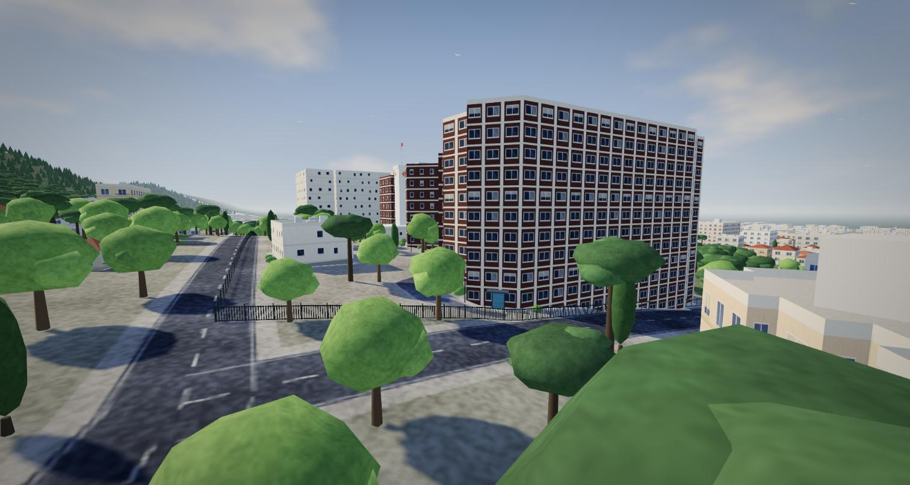
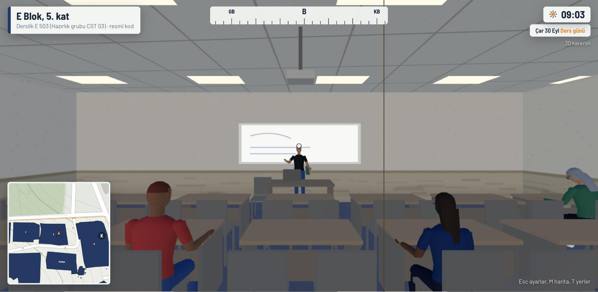
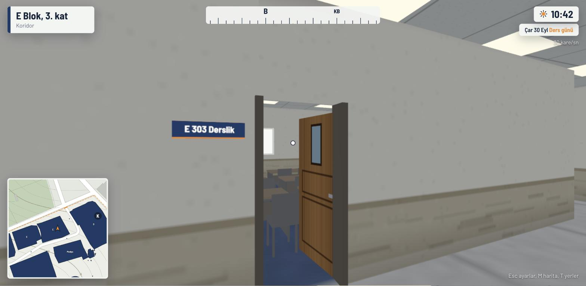
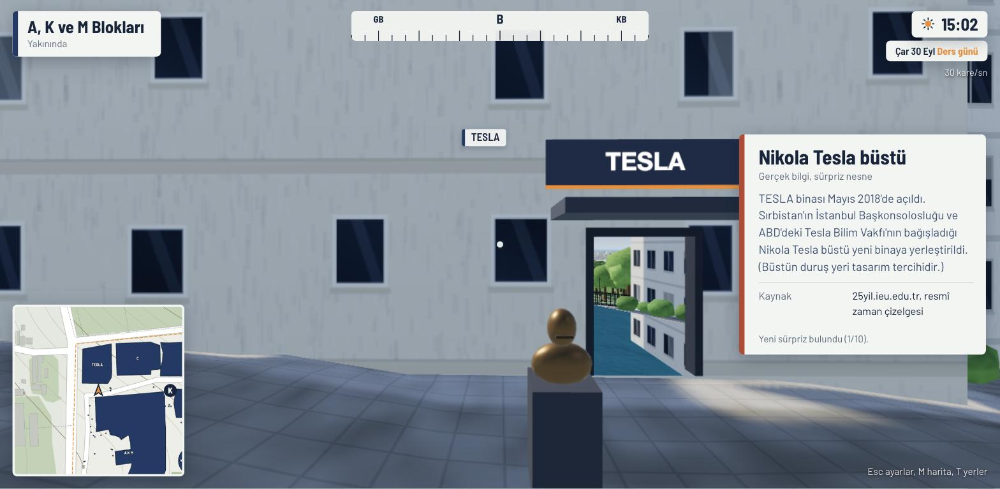
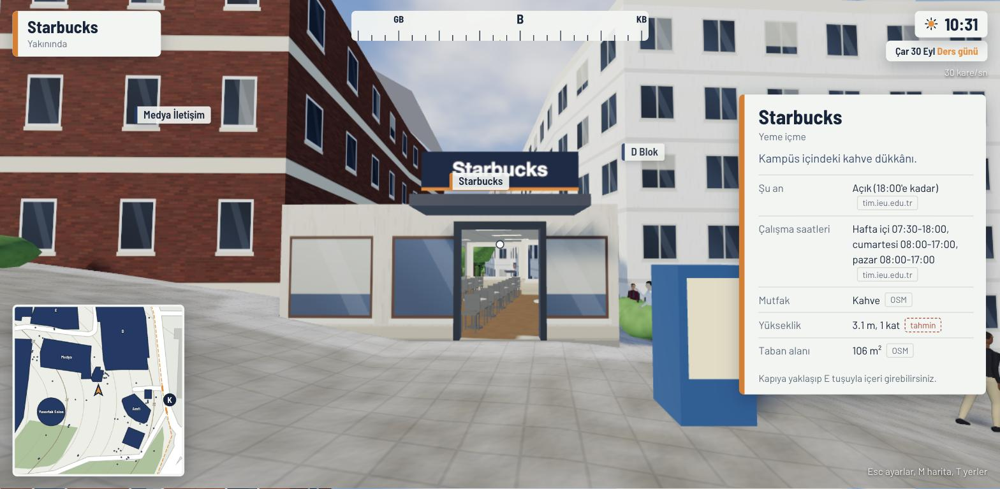
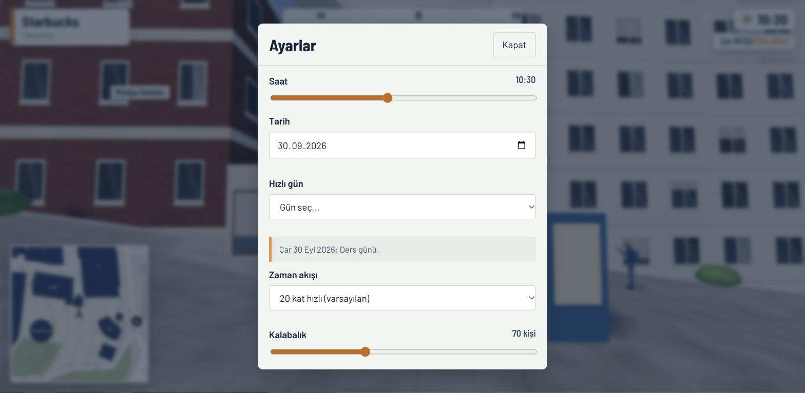

# İEÜ Balçova Kampüsü, 3B gezinti simülasyonu

İzmir Ekonomi Üniversitesi'nin **Balçova** kampüsünü (Sakarya Caddesi No:156) tarayıcıda yürüyerek gezdiğiniz üç boyutlu bir simülasyon. Güzelbahçe'de inşa edilen yeni kampüs ayrı bir yerleşkedir ve dahil değildir.

> **English:** a walkable 3D simulation of the Izmir University of Economics Balcova campus that runs in the browser (Three.js, no build step). Building footprints come from OpenStreetMap, building shapes are reconstructed from public photographs, the crowd is animated on the GPU and follows the real academic calendar, class periods and opening hours; room codes come from official pages. Everything that is an estimate is labelled as such.

> **Resmî bir proje değildir.** İzmir Ekonomi Üniversitesi ile bağlantısı yoktur, üniversite tarafından onaylanmamıştır. Üniversitenin adı ve basitleştirilmiş bir logo çizimi yalnız kampüsü tanımlamak için kullanılır. *Unofficial: not affiliated with or endorsed by Izmir University of Economics.*

Hedef: kampüsün **gerçekçi** ve **görsel olarak inandırıcı** bir kopyası. Oyun katmanı yok; bilgi, saat, takvim ve oda kodları halka açık kaynaklardan geliyor, tahmin olan her şey ayrıca etiketli.

## Ekran görüntüleri

| | |
| --- | --- |
|  |  |
| Ana plaza ve ana bina, gündüz: tuğla gövde, krem bantlar, logolu kule, saçak, portakal ağaçları. | Aynı görünüm gece: turuncu aydınlatılmış kule, saçak ve yanan pencereler. |
|  |  |
| Kuzeyden: avludaki yuvarlak tuğla salon, ana bina, gri metal çatılı uzun salon (Medya İletişim). | Yurt bloğu: ~11 kat, tuğla paneller ve krem ayaklar. |
|  |  |
| E 503: hazırlık grubu CST 03 resmî programa göre derste, öğretmen ayakta. Sağ üstte gün ve saat. | Koridorda açık ahşap kapı kanadı; E 303 kodu resmî sınıf listesinden. |
|  |  |
| Sürpriz: Tesla büstü (bilgi gerçek, nesne tasarım tercihi), kıvılcımlar ve kaynaklı kart. | Starbucks: gerçek çalışma saatleri ve şu an açık mı kapalı mı. |
|  | |
| Ayarlar: tarih, "Hızlı gün" (sınav haftası, bayram, hafta sonu...), zaman akışı, kalabalık. | |

Görüntüler simülasyonun kendi ekran çıktılarıdır; üçüncü taraf fotoğraf içermez.

## Çalıştırma

```bash
python3 tools/serve.py          # http://127.0.0.1:8765/
```

Sonra tarayıcıda `http://127.0.0.1:8765/` adresini açın ve **Kampüse gir**'e tıklayın. Sunucu önbelleksiz çalışır, dosyaları değiştirip sayfayı yenilemeniz yeter. Ek bir kurulum yok: Three.js ve yazı tipleri projenin içinde (`js/vendor`, `css/fonts`).

Adres parametreleri: `?date=2026-11-10` (tarih), `?t=12.5` (saat), `?q=low|mid|high` (kalite). Başka bir port için `python3 tools/serve.py 9000`. Node varsa aynı komutlar `npm run serve`, `npm run build:dataset`, `npm run build:real`, `npm run test:layout` olarak da çalışır.

## Kontroller

| Tuş | İş |
| --- | --- |
| W A S D, fare | Yürü, etrafa bak |
| Shift, Boşluk | Koş, zıpla |
| E | Kapıdan gir, merdivende üst kata çık, yayaya selam ver (el sallar), nesneyi incele |
| Q | Merdivende alt kata in |
| M | Harita (eş yükselti çizgili plan). Haritaya tıklayınca ışınlanırsınız |
| T | Yerler listesi |
| I | Bilgi paneli: kampüs, fakülteler, laboratuvarlar, veri seti, bulunan sürprizler |
| V | Uçuş modu |
| H | Arayüzü gizle (ekran görüntüsü için) |
| Esc | Ayarlar: saat, **tarih**, hızlı gün seçimi, zaman akışı, kalabalık, kampüs dışı, trafik, gölge... |

## Neler var

- **Gerçeğe yakın binalar.** Ana bina (A, K, M): tuğla kırmızısı gövde, krem bantlar, logolu beyaz kule, dalgalı beyaz giriş saçağı, çatıda "İZMİR EKONOMİ ÜNİVERSİTESİ" yazısı, gece turuncu aydınlatma. Ana kapı saçağın altında. Yuvarlak tuğla salon avluda ayrı bir bina, yurt ~11 kat, E Blok 7 kat, gri metal çatılı uzun salon (Medya İletişim). Yükseklikler ve cepheler fotoğraflardan çıkarıldı (bkz. dürüst notlar).
- **İnsanlar.** 300'e kadar tek tek animasyonlu kişi: yürür, koşar, telefonla yürür, kitap taşır, konuşur, içecek içer, ders anlatır, sandalyede yazar/okur/telefona bakar, çimde oturur. Kıyafet, saç, tesettür, gözlük, sırt çantası, boy ve ten çeşitli. Yakındakiler size bakar; **E** ile selam verirseniz durur, döner, el sallar.
- **Takvime bağlı işleyiş.** Kampüs bugünün tarihini ve saatini kullanır. Ders günü, telafi cumartesisi, sınav haftası, resmî tatil, hafta sonu, dönem arası ve yaz tatili gerçek akademik takvimden ayrılır. Ders başlangıçları (08:30, 09:25, ... 15:50) gerçektir; teneffüslerde yollar ve koridorlar dolar, derslerde boşalır, öğlen kafeler kalabalıklaşır, sınav haftasında kütüphane dolar, geceleri kampüs neredeyse boştur. İnsanlar kapılardan girip çıkar.
- **Gerçek sınıf programı (E Blok).** Yabancı Diller Yüksekokulu hazırlık grupları resmî duyuruya göre (A, B, C seviyeleri; Pzt-Çar-Cum ve Sal-Per pencereleri) kendi sınıflarında derste olur: sınıf doludur, öğretmen ayaktadır. Ders dışında sınıf boştur.
- **Gerçek oda kodları.** E Blok'ta E 101 - E 609, C Blok laboratuvarları (C 302-309, C 601-609), D Blok stüdyo ve laboratuvarları (D 201, DB 030...), TESLA (ML 1xx, ML 2xx), A Blok'ta PGDM (-1. kat). Kodun ilk rakamı kattır. Üst plakada "resmî kod" yazan odalar gerçektir; geri kalanı aynı düzende üretilmiş örnek koddur.
- **Çalışma saatleri.** Starbucks kartı gerçek saatleri ve şu an açık mı kapalı mı olduğunu gösterir. Kapalıyken içi boştur.
- **Bina içleri.** Kapılardan girilir. Açık ahşap kapı kanatları, koridor panoları, derslik, laboratuvar, ofis, stüdyo, yurt odası, kütüphane, kat tabelaları, merdiven ve asansör çekirdeği. Katlar E ve Q ile değişir. Kat numarası ana giriş katından sayılır, altında bodrum katlar vardır.
- **Sürprizler.** Tesla büstü (kıvılcımlar), otel zili ve konuk defteri, oda kodu rehberi, amfi plaketi ve gece ışıkları, jeotermal buhar, kırmızı telefon kulübesi, bariyerde DUR levhası; ayrıca kurgusal olarak kedi ofis saatleri, sözler veren otomat ve kayıp ödev sayfası. Her birinin etiketi ("Gerçek" ya da "Kurgu") ve kaynağı kartta yazar. Bulunanlar Bilgi panelinde sayılır.
- **Çevre.** Gerçek arazi eğimi, çam ormanlı yamaç, mahalle, Balçova Teleferiği, ufukta İzmir Körfezi, yaprak dokulu ağaçlar, portakal ağaçları. Gün döngüsü gerçek Güneş geometrisiyle; gece yanan pencereler, lambalar, ay ışığı. Ekran alanı efektleri: ortam tıkanması, parlama, film benzeri renk; kare hızına göre kalite kendiliğinden ayarlanır.

## Dürüst notlar

- Bina taban alanları **OpenStreetMap**'ten. **Yükseklikler ve cepheler halka açık fotoğraflardan** (Wikimedia Commons, CC BY-SA) ve uydu görüntüsünden **tahmin edildi** (±1 kat). OSM'de ana bina 6, yurt 5 kat görünüyor; fotoğraflarda 7-8 ve ~11. Bu binalar bilgi kartında "fotoğraftan tahmin" etiketi taşır. E Blok'un 7 kat seçimi tutarlı: 8 kat x 1.221 m² taban = 9.768 m², resmî toplam inşaat alanı 9.646 m².
- **İç mekânlar gerçek kat planı değildir.** Yerleşim üretilmiş genel yerleşimdir. Gerçek olan yalnız oda kodu ve katıdır; odanın kat içindeki konumu bilinmiyor.
- **Ders bitiş saatleri ve teneffüs süresi yayımlanmıyor.** 45 dk ders + 10 dk teneffüs tahmindir. Lisans dersleri için gün, saat ve derslik programı girişli sistemlerde olduğundan yalnız E Blok hazırlık programı gerçek verilere dayanır.
- **Kafe ve kantin işletmelerinin hangi binada olduğu** kaynakta yazmıyor; yalnız Starbucks OSM adıyla eşleşti. Diğerlerinin saatleri veri setinde ama haritada yerleri yok.
- Yuvarlak salonun ve gri çatılı uzun salonun işlevi resmî kaynaklarda doğrulanamadı. Ana binanın eski Grand Plaza oteli olduğu bilgisi Vikipedi ve bir gazete yazısından geliyor (orta güven), resmî tarihçe sayfasında yok.
- Kırmızı tuğla, krem bant ve turuncu logo gibi görünüm ayrıntıları fotoğraflardan alındı; logo resmî çizim değil, basitleştirilmiş bir çizimdir.
- İnsanlar, arabalar, kediler, konuşma balonları ve "Kurgu" etiketli sürprizler canlılık için eklenmiş kurgusal öğelerdir. Hiçbir gerçek kişiye ait veri kullanılmadı.
- Arazi eğimi 25 m çözünürlüklü EU-DEM verisinden yumuşatılarak üretildi; küçük ölçekli teraslar gerçekte farklı olabilir.

## Veri seti ve yeniden üretme

Ayrıntılar ve doğrulama kaydı [DATASET.md](DATASET.md) dosyasında. Kısaca:

```bash
python3 tools/fetch_dem.py        # bölgesel yükseklik ağı (data/dem_world.json)
node tools/build_dataset.mjs      # data/campus.json (OSM + arazi + resmî sayfalar)
node tools/build_real.mjs         # data/real.json (araştırma dosyalarından oda kodları, takvim, saatler)
```

Ham araştırma çıktıları `data/research/` içindedir (oda kodları, işleyiş ve takvim, ders kataloğu, görünüm ve tarihçe). `tools/human_lab.html` insan modeli ve animasyonları tek başına denemek içindir.

## Proje yapısı

```
index.html, css/          Arayüz (yönlendirme tabelası stili)
js/main.js                Başlatma, ana döngü
js/campus_arch.js         Fotoğraf tabanlı bina kütleleri, bölgeler, ana kapı, yuvarlak salon
js/buildings.js           Duvarlar (bölge bazlı yükseklik ve cephe), çatılar, kule, saçak, kapılar
js/textures.js            Cephe dokuları (tuğla, sıva, beyaz ızgara...), logo, çatı yazısı
js/humanoid.js            İnsan iskeleti, ağı, 17 animasyon klibi (dikey animasyon dokusuna pişirilir)
js/humanrender.js         GPU'da insan oynatıcı (renk, saç, aksesuar, kafa dönüşü)
js/crowd.js, navgrid.js   Yayalar, A* yol bulma, kapılardan giriş çıkış, selamlaşma
js/schedule.js            Takvim, ders dilimleri, kalabalık eğrisi, açık/kapalı, SFL pencereleri
js/clock.js               Tarih ve saat
js/campuslife.js          Yaşam yönetmeni: takvime göre kalabalık ve hedefler
js/interior.js, layout.js İç mekân: kat planı, oda kodları, mobilya, kapı kanatları, doluluk
js/easter.js              Sürprizler (Gerçek ve Kurgu etiketli)
js/post.js                Ekran alanı efektleri (AO, parlama, renk)
js/sky.js                 Gökyüzü, güneş, ay, ortam ışığı
js/heightfield.js, ground.js, terrain.js   Arazi, zemin dokusu, deniz
js/vegetation.js, props.js, boundary.js    Ağaçlar, mobilya/teleferik/trafik, kampüs çiti
js/ui.js, mapdraw.js      HUD, harita, menüler
tools/                    Sunucu, veri üretimi, test ve deneme sayfaları
data/                     Ham ve işlenmiş veri; data/research/ ajan araştırmaları
```

## Lisans ve kaynaklar

- **Kod lisansı henüz seçilmedi**, varsayılan olarak tüm hakları saklıdır. Bir lisans eklenene kadar yeniden kullanım için yazara sorun.
- **Three.js r160** (MIT): `js/vendor/`, metni `js/vendor/LICENSE-three.txt`.
- **Barlow ve Barlow Semi Condensed** yazı tipleri (SIL Open Font License 1.1): `css/fonts/`, metni `css/fonts/OFL.txt`.
- **Harita verisi**: © OpenStreetMap katkıcıları, ODbL 1.0 (`data/osm_*.json` ve `data/campus.json` içindeki türevler).
- **Yükseklik**: EU-DEM v1.1 (Copernicus verisi), OpenTopoData API üzerinden.
- **Resmî bilgiler** (oda kodları, takvim, saatler, tarihçe): İEÜ'nün halka açık sayfaları; kaynak adresleri `DATASET.md` ve `data/research/*.json` içinde. Kişisel veri toplanmadı; ham OSM dosyalarında işletme adı olarak geçen adlar (ör. bir muayenehane) OpenStreetMap'ten olduğu gibi gelir.
- **Fotoğraflar**: Wikimedia Commons'taki (CC BY-SA) kampüs fotoğrafları ve uydu görüntüsü yalnız bina yükseklik ve cephe kıyası için incelendi; projeye görüntü gömülmedi.
